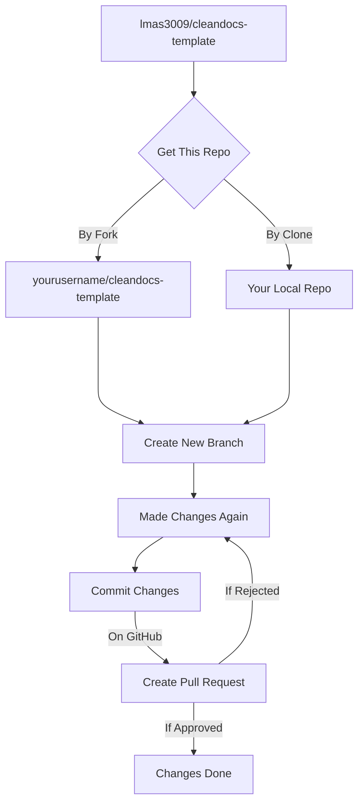

# cleandocs-template
A documentation template built using HTML, Tailwindcss and Javascript


**Clone the repository**
```bash
git clone https://github.com/lmas3009/cleandocs-template.git
```

# Contributing

All code contributions - if you want change the ui -  must go through a pull request and be approved by a core developer before being merged. This is to ensure a proper review of all the code.

After making changes add your information in contributors section in index.html

We truly ❤️ pull requests! If you wish to help.

✅  &nbsp; Add your information on website, please follow [Contribution Guide](https://github.com/lmas3009/cleandocs-template/blob/master/CONTRIBUTING.md)

# Visual Representation


# Copyright and license
The MIT License (MIT) http://www.opensource.org/licenses/mit-license.php
